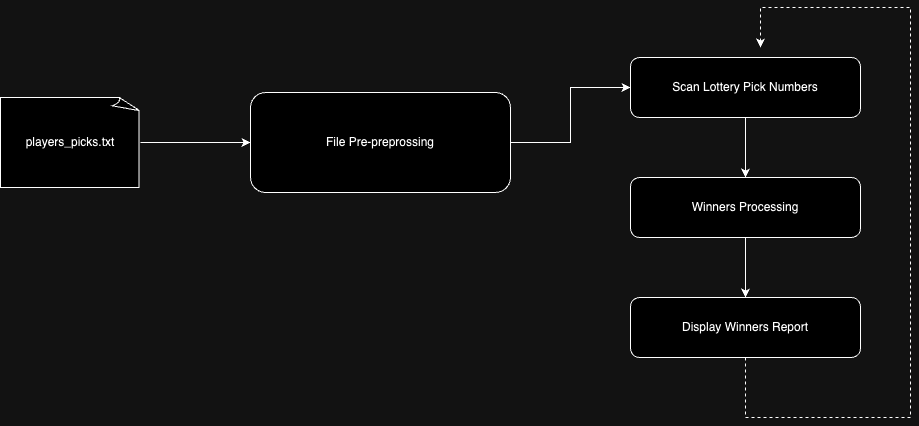

# Hungarian Lottery Checker

This project is focused to process and display an report for numbers of wiiners from Hungarian Lottery Checker.

The main concern of this is provide a report from a lottery pick in the better possible performance.

## How to Run

To run the program in cmd, it just required enter with the following cmd with 2 argments:

* The first one is the file name (absolute path)
* The seconde one is number of lines

```go
go run internal/cmd/main.go simple.txt 8
````

## Solution Overview

The workflow of the solutions is basiclly in the following steps:

1. File Preprocessing
2. Scan Lottery Pick Numbers
3. Winners Processing
4. Display Winners Report



### 1. File Preprocessing

In this step the program read the whole file in an buffer (line by line) instead of the load the file into memory once in the memory. This is a better approach to avoid a high memory consumption in this step.

For each line (player pick) is performed:

* All possible numbers combinations for 2, 3, 4 and 5 tuples size.
* For each combination a hash is generated according to the following rule:

    * Sort numbers asceding
    * Concatenate numbers and generate a string from it

For example:

For the player pick ``10 67 12 32 44`` we have 5 possibles combinations for ``4`` tuples

| Possible combinations  | Generated hash |
| ------------- |:-------------:|
| 10 67 12 32     | 10123267     |
| 10 67 12 44     | 10124467     |
| 10 12 32 44      | 10123244     |
| 10 67 32 44      | 10324467     |
| 67 12 32 44      | 12324467     |

This hash algorithm ensures that this will be unique for any combination regardless order.

Each number line is selected to become a player pick identifier. Once in the report shoulds display the number of winners player's pick (not the numbers of matchers), a hash map in this step is generated in memory so that the key is the generated hash for the tuple and the value a slice contaning the player pick identifier that matched with that tuple, like this data strucuture defined in ``players_combinations.go`` file:

```go
type CombinationsOcurrrencies map[string][]int32
```

While the file is being processing the user can check the progress in the terminal:

`````
Pre-processing file...
Progress: 76.88%
`````

### 2. Scan Lottery Pick Numbers

Once the file is preprocessed and the whole hashmap is loaded in memory, the terminal display ``READY``.

After that the user can enter with any lottery pick number with 5 digitis separated by space and then Enter.

Make sure that you enter in this format:

````
36 42 79 21 58_
````

### 3. Winners Processing

In this step, after the user enter with lottery pick numbers, the program will generate all possible combinations for the entered numbers, as the same way that was done in the **File Preprocessing** step.

For each combination, the program will compute the number for winners for each size tuple category. To achieve this, a secondary data struture was created that stores and correlate player idenfier with the tuple size in order to avoid of the same player pick be computed more than one time for the same category size tuple category. For example: considering for player pick ``4 79 13 80 56``, and the pick lottery ``4 79 99 80 56``, notice the player match 2 times for tuple size 2 (``4 79`` and ``80 56``), however this player pick should be counted only one time as the pick number is the same. The data structure defined in the file ``winners_process.go`` is:

````go
type WinnersComputed map[int32][]bool
````

### 4. Display Winners Report

The final step is display the numbers of winners by the tuples size category, like this:

````
| Numbers matching | Winners
|         2        | 26102 
|         3        | 904 
|         4        | 32 
|         5        | 2 
````

After that the user can enter with another lottery pick number

## Big O Assessment

In terms of asymptotic assessment for the Big O notation could be considerated the following aspects:

* Time complexity
* Space complexity

The solution core is implemented in the steps **File Preprocessing** and **Winners Processing**. Let's assess the asymptotic run time for these.

#### 1. File Preprocessing Assessment

Considering the size entry ``n``, and the number of combinations for each player pick is ```m``` (for fixed numbers of size 2, 3, 4 and 5). Considering the numbers of combination for each entry is calculated by:

$$
C(n, k) = \frac{n!}{k!(n - k)!}
$$


For each entry we have:

| Tuple Size  | Number of Combinations |
| ------------- |:-------------:|
| 2     | 10 combinations     |
| 3     | 10 combinations     |
| 4      | 5 combinations     |
| 5      | 1 combination     |

This we have the fixed number of 26 possibities in the total. Thus, ```m = 26```.

For this case the time and space complexicity are equals the representated by:

$$
O(m*n)
$$

Once that m is constant and equal 26 the Big O notation could ommit, resulting:

$$
O(n)
$$


#### 2. Winners Processing Assessment

For Winners processing step, the algorithm already have the hash map load in memory and the time complexity to lookup the combination key is:

$$
O(1)
$$

This is because for the each calculated combination from the lottery pick numbers is hashed and lookup in the hashmap.

However, the loopkup operation still not the final answer for the report, once it is required calculated the numbers of the winners according to the values in slice value. However the amount of set to check is minimized in the **File Preprocessing** step. Once that here we have the big indicator:

`````
Divide and Conquer algorithms that split the problem into smaller pieces
`````
And the subset was divided in smaller collections according to the matchers for each one combination, we would have the following time complexicity:

$$
O(n*log n)
$$

## Future Contributions

Once we had few time to complete the solution of this problem, I would suggest some improvements.

* For this purpose we consided the maximum 10 millions for the size of the entry. In terms of scallabity wouldn't feaseable load all data in memory in a real situation for huge ammount of data. A message-broker like Kafka or even RabbitMQ would be a good option to process the data.
* Still talking about scallabity, have a distributed cache to store the hash map like Redis is a good option. Thus, a replicated node to perform and paralellize would be good to avoid a Single PoF. Kubernetes is an alternative.
* Unit tests, integration tests, load tests